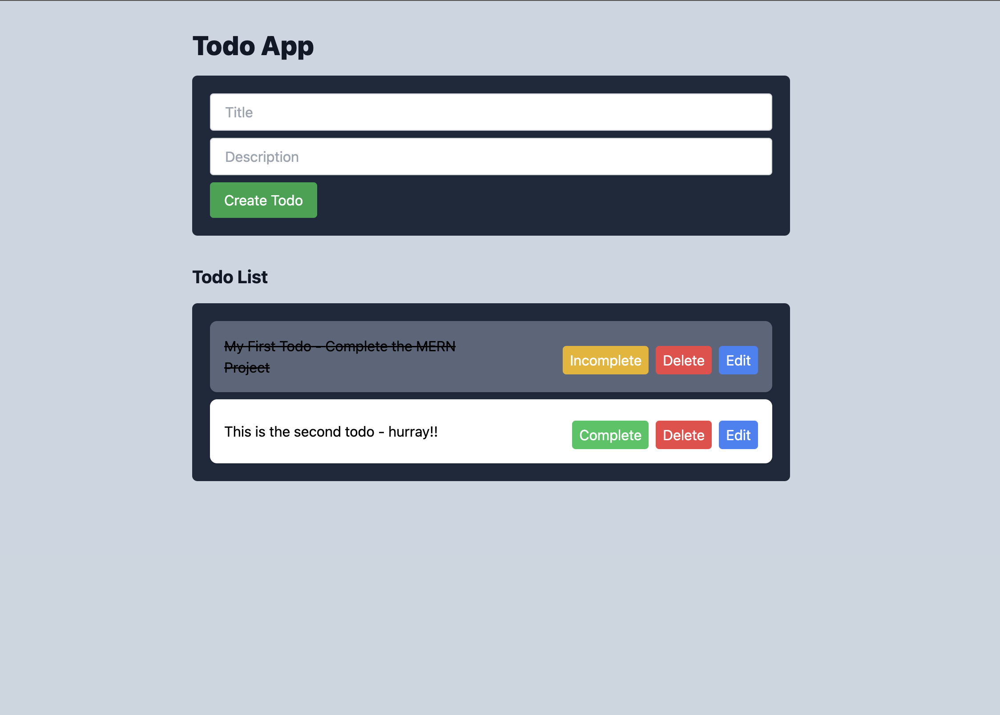

# TODO APP built with MERN Stack

## Setup

### Clone the repo
```shell
git clone https://github.com/iam-naveen/mern-todo-app.git

cd mern-todo-app
```

### Configure the Database Connection
Add the database info in the .env file
```.env
MONGO_USER = <your_username>
MONGO_PWD = <your_password>
MONGO_URL = <your_database_url>
```
Sample .env file is provided in the repo as `.env.sample`
### Install dependencies and Run

for backend
```shell
cd backend
```
```shell
npm install
```
```shell
npm run dev
```

for frontend
```shell
cd frontend
```
```shell
npm install
```
```shell
npm run dev
```

## Screenshots
